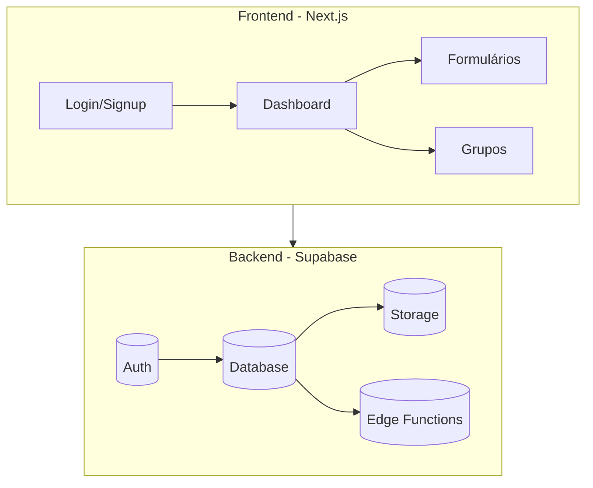

# GameFy_Web


O **GameFy** é uma plataforma acadêmica interativa desenvolvida com **Next.js** que permite **criar, responder e gerenciar formulários**, gerar **grupos automaticamente** (como para Projetos Integradores da FECAP), e acompanhar a organização de alunos e professores de forma simples e intuitiva.

> 🚀 O projeto é hospedado na [Vercel](https://vercel.com) e utiliza **Supabase** como backend (autenticação, banco de dados e storage).

---

## 📑 Sumário

- [Visão Geral](#-visão-geral)
- [Funcionalidades](#-funcionalidades)
- [Stack Tecnológica](#-stack-tecnológica)
- [Arquitetura](#-arquitetura)
- [Instalação e Execução](#-instalação-e-execução)
- [Variáveis de Ambiente](#-variáveis-de-ambiente)
- [Deploy na Vercel](#-deploy-na-vercel)
- [Estrutura de Pastas](#-estrutura-de-pastas)
- [Contribuidores](#-contribuidores)
- [Licença](#-licença)

---

## 🔎 Visão Geral

O **GameFy** nasceu para apoiar professores e alunos em **gestão de grupos e atividades acadêmicas**.
Entre os principais cenários de uso estão:

- Professores que precisam organizar grupos de PI's (Projetos Integradores).
- Alunos que enviam seus dados de forma estruturada e são automaticamente alocados.
- Relatórios e dashboards que ajudam no acompanhamento do progresso.

---

## ✨ Funcionalidades

✅ Criação e edição de formulários personalizados.
✅ Geração automática de grupos com base nas respostas dos alunos.
✅ Dashboard com gráficos e tabelas (ex.: ingressos, avaliações, participação).
✅ Autenticação e gerenciamento de usuários via **Supabase Auth**.
✅ Upload e gerenciamento de arquivos/imagens via Supabase Storage.
✅ Design responsivo (funciona em desktop e mobile).
✅ Deploy contínuo via **Vercel**.

---

## 🛠️ Stack Tecnológica

- **Frontend**: [Next.js](https://nextjs.org/) (App Router), React 18, Tailwind CSS, MUI
- **Backend**: [Supabase](https://supabase.com/) (Auth, Database, Storage, Functions)
- **Infra**: Vercel (hosting), GitHub (versionamento)
- **Outros**: Framer Motion (animações), ESLint, Prettier

---

## 🏗️ Arquitetura



---

## ⚙️ Instalação e Execução

### Pré-requisitos

- Node.js 18+
- npm ou yarn
- Conta no [Supabase](https://supabase.com)

### Passos

```sh
# Clone o repositório
git clone https://github.com/seu-usuario/gamefy.git
cd gamefy

# Instale as dependências
npm install

# Configure as variáveis de ambiente (veja abaixo)

# Rode em modo desenvolvimento
npm run dev

# Build para produção
npm run build
npm start
```

---

## 🔐 Variáveis de Ambiente

Crie um arquivo `.env.local` na raiz com:

```ini
NEXT_PUBLIC_SUPABASE_URL=https://xxxx.supabase.co
NEXT_PUBLIC_SUPABASE_ANON_KEY=seu_anon_key
SUPABASE_SERVICE_ROLE_KEY=seu_service_role_key
BASEPATH=/gamefy # ou vazio ""
```

---

## 🌍 Deploy na Vercel

1. Conecte o repositório no painel da [Vercel](https://vercel.com).
2. Configure as variáveis de ambiente no projeto → **Settings → Environment Variables**.
3. Se precisar de subpasta, use o `basePath` no `next.config.js` + redirect no `vercel.json`.

---

## 📂 Estrutura de Pastas

```
src/
 ├── app/                # App Router do Next
 │    ├── grupos/        # Tela de grupos
 │    ├── forms/         # Tela de formulários
 │    └── dashboard/     # Tela inicial
 ├── components/         # Componentes reutilizáveis
 ├── lib/                # Conexão com Supabase
 ├── styles/             # Estilos globais
 └── utils/              # Helpers
```

---

## 👨‍💻 Contribuidores

- **Victor Bruno Alexander Rosetti de Quiroz** - [GitHub](https://github.com/VictorRosetti) | [LinkedIn](https://www.linkedin.com/in/victorbarq/)
- **Vinicius Nishimura Reis** - [GitHub](https://github.com/Vinishireis) | [LinkedIn](https://www.linkedin.com/in/vinicius-nishimura-reis/)

_(adicione os colegas de equipe aqui se for trabalho em grupo)_
